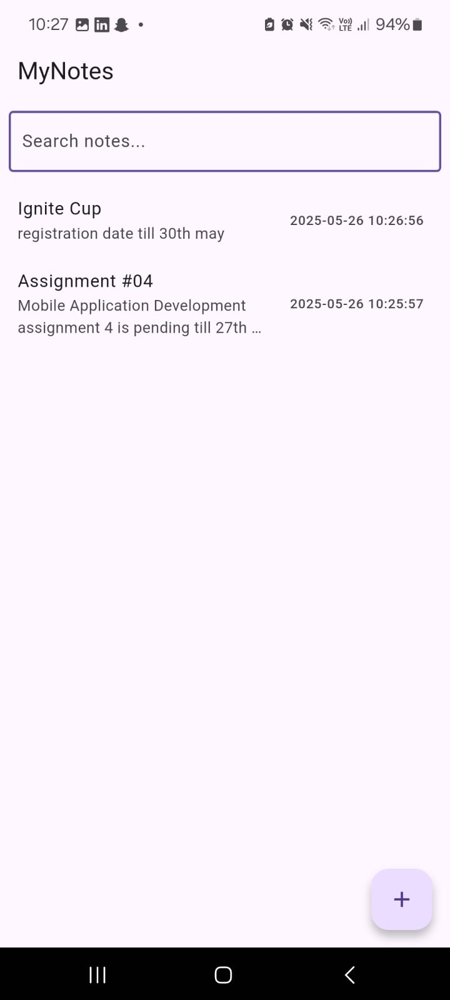
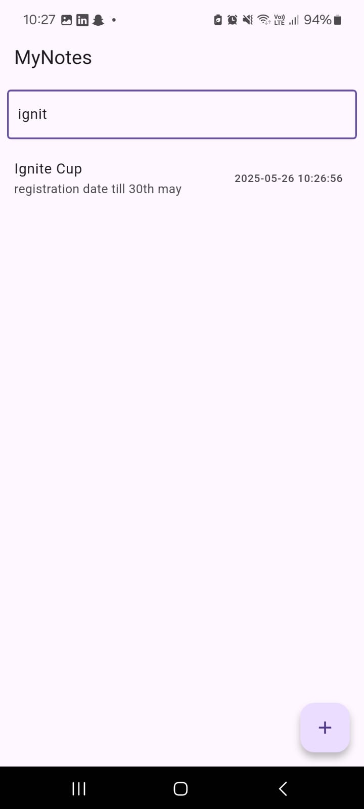

# 📝 MyNotes - Flutter Note-Taking App

## 📌 Overview
**MyNotes** is a fast, lightweight, and beautifully designed note-taking application built with **Flutter**. It supports creating, editing, searching, and persisting notes **locally** using **SQLite (sqflite)**, making it fully functional even when offline.

This project was developed as part of the **Final Exam Flutter Project** for Bahria University's Mobile App Development course.

---

## ✨ Features

- 🗒️ View a list of saved notes with title, preview (first 2 lines), and timestamp
- ➕ Floating action button to create a new note
- ✏️ Edit existing notes by tapping them
- 🧹 Delete notes easily
- 🔍 Real-time search filtering by title or content
- 💾 Local storage using SQLite for persistent saving across app restarts
- 🧭 Simple, intuitive UI

---

## 🎯 Project Goals

- Learn how to build a complete Flutter app with navigation
- Use **sqflite** for local persistent storage
- Implement CRUD (Create, Read, Update, Delete) operations
- Apply responsive and scrollable layouts
- Explore search filtering in real time

## ⚙️ How It Works

1. **Home Screen**
   - Fetches notes from local SQLite DB
   - Displays in ListView with previews
   - Real-time search bar filters notes dynamically
   - Tap on a note to view/edit

2. **Create/Edit Screen**
   - Input fields for title and content
   - Saves or updates the note in SQLite DB
   - Optional delete button for existing notes

3. **Local Database**
   - Uses `sqflite` for persistent storage
   - Notes remain available even after restarting the app

---

## 📦 Dependencies

- [`sqflite`](https://pub.dev/packages/sqflite)
- [`path_provider`](https://pub.dev/packages/path_provider)
- [`intl`](https://pub.dev/packages/intl) for timestamp formatting

Install with:

flutter pub get

🖼️ Screenshots

🔹 Home Screen

Displays list of notes with real-time search and timestamps

  

🔹 Add/Edit Note

Create or update your notes using a simple form

  

🔹 Search Note

Search From the list of created notes

  

🏁 Getting Started

1. Clone the repository:

git clone https://github.com/awab-sial/final_exam.git
cd final_app

2. Ensure Flutter is installed and connected:

flutter doctor

3. Run the project:

flutter pub get
flutter run

---

🧠 Learning Outcomes

Working with persistent storage

Flutter navigation and state management

Real-time search implementation

SQLite CRUD operations in mobile apps

---

📜 License

This project is for educational purposes only, developed as part of the Mobile App Development Final Exam at Bahria University.

---

🙌 Acknowledgments

Instructor: Sir Burhan Abbasi

Submitted By: Muhammad Awab Sial

Class: BS-CS 6B

Session: Spring 2025

